### Hi 👋, I'm Haolin Shi(史昊霖)
  

I am currently working as an Algorithm Engineer specializing in Content Generation and Understanding at Youku. I hold a Master’s degree from the School of Cyber Science and Technology at the University of Science and Technology of China, and a Bachelor’s degree from the Department of Electronic Engineering and Information Science, School of Information Science and Technology.  

🔭 I’m currently working on visual content generation and content understanding.  
🌱 I’m currently learning computer graphics and computer vision.  
🕹️ My favourite games are Where Winds Meet, Honkai: Star Rail, Honkai Impact 3rd, Final Fantasy XIV, and Tsuki ni yorisou otome no sahou(月に寄りそう乙女の作法)<!--大変に気分がいい～-->.  
🎵 I like listening to music. My favourite singer is [三无Marblue](https://space.bilibili.com/284120), and I also like Chinese VOCALOID.  
📫 How to reach me: I’m happy to chat! You can contact me on WeChat with ID: `Ookura_Resona`<!-- or on Telegram [@SakurakoujiLuna](https://t.me/SakurakoujiLuna)-->.  

[](https://github.com/anuraghazra/github-readme-stats)
[](https://github.com/anuraghazra/github-readme-stats)


【内推直通车】优酷核心团队招聘，长期有效
公司聚焦 AIGC / 大模型应用层，技术氛围浓厚，牛人多，成长快。目前急招：大模型算法、搜推广算法、前后端开发、AI 产品经理等。走我内推，简历优先直达部门，实时跟进进度，全程答疑。薪资 open，期权加持。有意者请将简历及意向岗位发至[我的邮箱](mailto:shihaolin.shl@alibaba-inc.com)：

```
shihaolin.shl@alibaba-inc.com
```

或通过官网投递时填写我的推荐码：

```
1V9S0F
```
